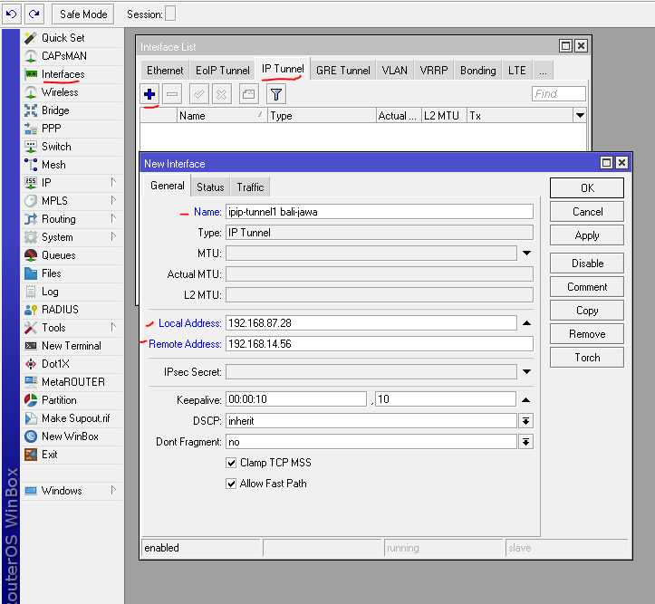
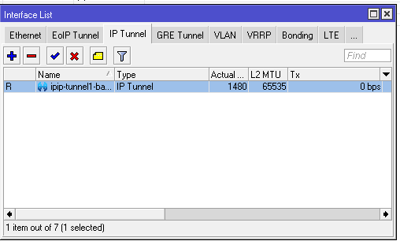
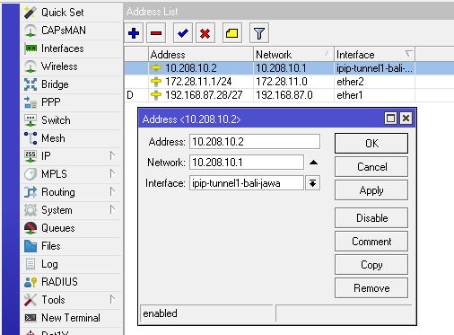
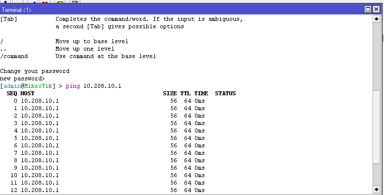
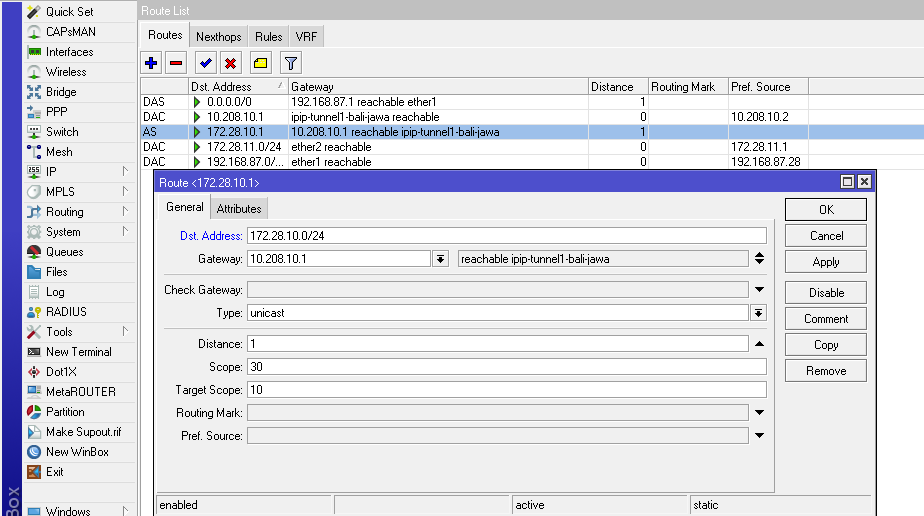
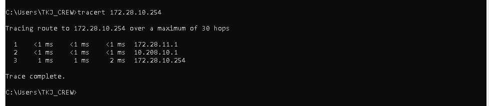

# LAB-40-Tunnel
tanggal 22 agustus 2025

# tunnel 
IP tunnel adalah kanal jaringan komunikasi Protokol Internet (IP) antara dua jaringan komputer yang digunakan untuk transportasi menuju jaringan lain dengan mengkapsulkan paket ini. IP Tunnel sering kali digunakan untuk menghubungkan dua jaringan IP tidak bergabung yang tidak memiliki alamat penjaluran asli (native routing path) ke lainnya, melalui protokol penjaluran utama melewati jaringan transportasi tingkat menegah. Bersama dengan protokol IPsec keduanya kemungkinan digunakan untuk membuat jaringan maya pribadi (Virtual Private Network) antara dua atau lebih jaringan pribadi melewati jaringan umum misalnya internet.

# konfigurasi router bali 
1. lakukan konfigurasi dasar
2. jika sudah terhubung ke internet kita pilih menu
   interfaces > ip tunnel
3. klik (+)
4. masukkan nama (opsional)
   lalu local address : ip publik bali
   remote address : ip publik jawa
   klik ok

6. jika muncul flag R maka artinya router bali dan jawa sudah terhubung

7. lalu kita tambahkan ip address untuk interface ip tunnel bali-jawa
   pilih menu ip > address
   klik (+)
   address : ip yang sudah di berikan router jawa 10.208.10.2
   network : ip address router jawa 10.208.10.1

8. lalu coba ping ke router jawa

9. lalu kita buatkan routing
   pilih menu ip > routes
   klik (+)
   dst.address adalah ip lan dari router jawa
   gateway : 10.208.10.1

10. kita coba tes di laptop lewat cmd

