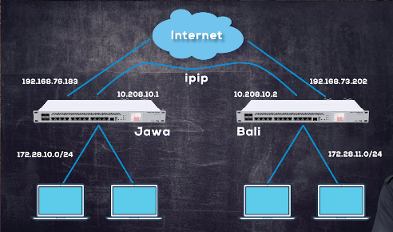
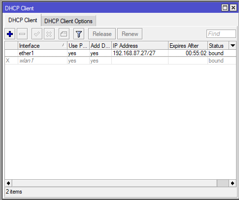
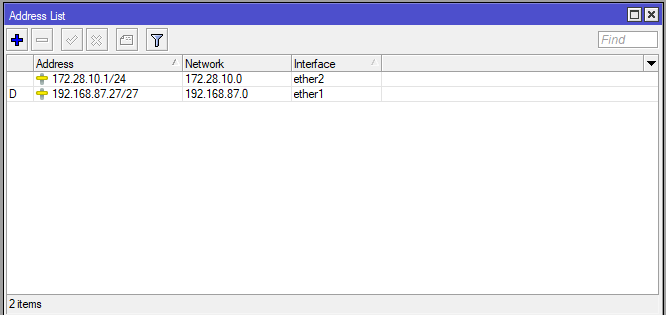
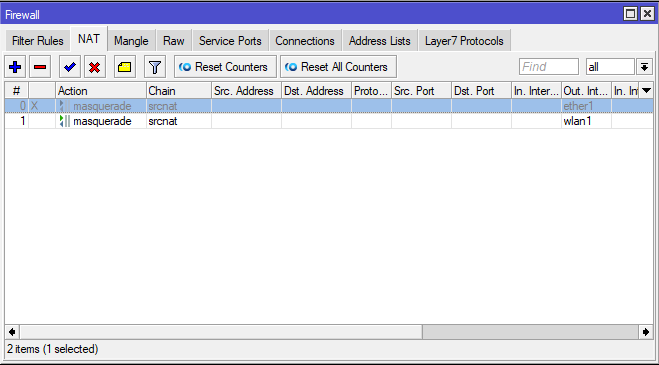
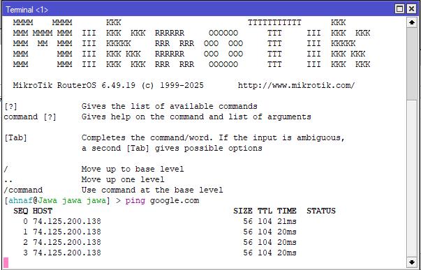
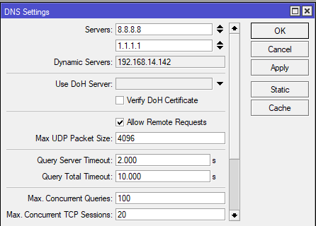
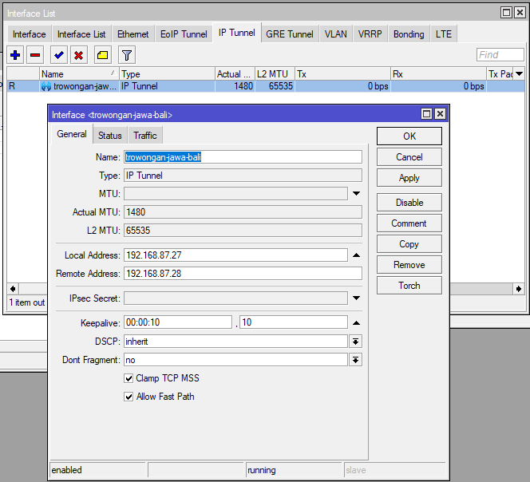
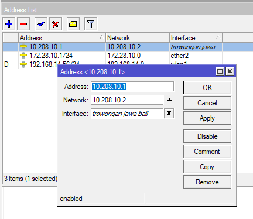
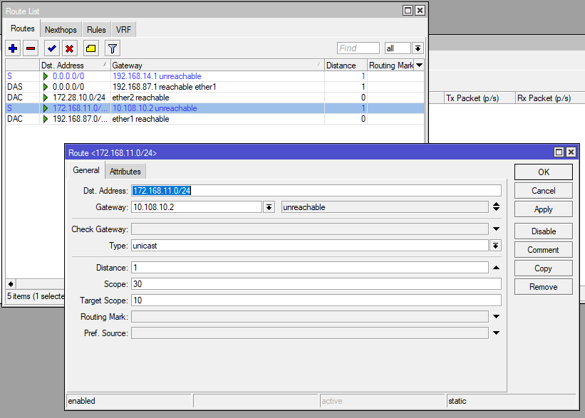

# LAB-40-Tunnel
tanggal 22 agustus 2025

# tunnel 
IP tunnel adalah kanal jaringan komunikasi Protokol Internet (IP) antara dua jaringan komputer yang digunakan untuk transportasi menuju jaringan lain dengan mengkapsulkan paket ini. IP Tunnel sering kali digunakan untuk menghubungkan dua jaringan IP tidak bergabung yang tidak memiliki alamat penjaluran asli (native routing path) ke lainnya, melalui protokol penjaluran utama melewati jaringan transportasi tingkat menegah. Bersama dengan protokol IPsec keduanya kemungkinan digunakan untuk membuat jaringan maya pribadi (Virtual Private Network) antara dua atau lebih jaringan pribadi melewati jaringan umum misalnya internet.

# Konfigurasi IP in IP

  
  
# Konfigurasi router jawa 
  
1. Pastikan R1 sudah memiliki konfigurasi dasar sampai terhubung ke internet.  

  

  

  

  

  

3. Jika sudah, sekarang konfigurasi IP Tunnel di Router Jawa. di **Interfaces > IP Tunnel**. Masukan Local Address dan Remote Address. Local address adalah IP Public dari router 1 (Jawa), dan remote Address adalah IP Public dari router tujuan (Bali). Cukup ini yang perlu dikonfigurasi di IP Tunnel.  

  

4. Selanjutnya tambahkan IP Address untuk Interface IP Tunnel Jawa-Bali. IP Addresnya 10.208.10.1 dan Network isi dengan 10.108.10.2 yang akan digunakan di interface IP Tunnel Router 2 (Bali), lalu Interfacenya pilih ke ip tunnel, jika sudah APPLY dan OK.  

  

5. Untuk menghubungkan LAN dari Router Jawa ke Bali, kita bisa pake static routing. Untuk Dst Address, kita isikan IP LAN Router Balinya, dan gatewaynya adalah IP dari Interface IP Tunnel Router Bali.  

  

# konfigurasi router bali 
1. lakukan konfigurasi dasar  
2. jika sudah terhubung ke internet kita pilih menu       
   interfaces > ip tunnel      
3. klik (+)  
4. masukkan nama (opsional)  
   lalu local address : ip publik bali   
   remote address : ip publik jawa   
   klik ok  

5. jika muncul flag R maka artinya router bali dan jawa sudah terhubung

6. lalu kita tambahkan ip address untuk interface ip tunnel bali-jawa    
   pilih menu ip > address   
   klik (+)   
   address : ip yang sudah di berikan router jawa 10.208.10.2  
   network : ip address router jawa 10.208.10.1   

7. lalu coba ping ke router jawa

8. lalu kita buatkan routing  
   pilih menu ip > routes   
   klik (+)   
   dst.address adalah ip lan dari router jawa  
   gateway : 10.208.10.1  

9. kita coba tes di laptop lewat cmd bukti bahwa bisa berkomunikasi 

# keimpulan

tunnel adalh Teknik yang  digunakan untuk menghubungkan dua jaringan secara aman atau virtual, terutama ketika kedua jaringan berada di lokasi yang berbeda secara geografis.

# sumber

https://youtu.be/icnJrQjiUW4?si=FUUvyRla8IwyFnva
